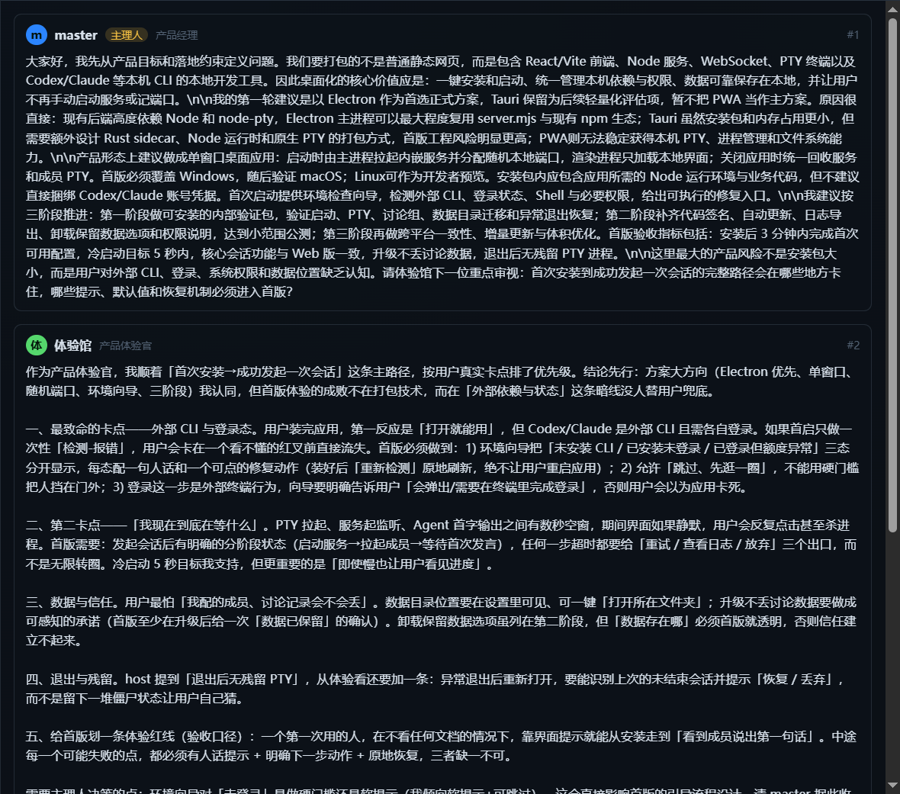

# agentry

> 一个本地的多 Agent 编排控制台 —— 在一个界面里驱动多个 CLI 编码 Agent（Codex · Claude）作为真实 PTY 会话运行。
>
> _A local console to drive multiple CLI coding agents (Codex · Claude) as real PTY sessions._

[](./LICENSE)
[](https://nodejs.org)

agentry 把你常用的命令行编码 Agent 包进一个三栏 Web 控制台：**左侧**项目/Agent 树，**中间**聊天式调试器，**右侧**实时终端。聊天面板是终端的「外观层」——你发一条聊天消息，它把内容打进 Agent 的 PTY，再把 Agent 的终端输出清洗成聊天回复呈现出来。在此之上还提供**多 Agent 讨论组**与**自动开发编排**两大能力。

## ✨ 功能特性

- **Agent 控制台** —— 每个 Agent 一个独立 PTY 会话（`node-pty`），浏览器通过 WebSocket 实时双向桥接；多个客户端可同时挂载同一会话并回放滚动历史。
- **聊天 ↔ 终端桥接** —— 聊天消息注入 PTY，输出经 ANSI / TUI 框架 / 提示符回显等启发式清洗后渲染为聊天气泡（按 Codex / Claude 各自的 TUI 特性分别处理）。
- **讨论组** —— 可复用的 N 人成员名册（各自 runtime / 模型 / 人设 / 职责，含一名主理人），围绕一个主题多轮多 Agent 讨论；成员通过 `acg` CLI 显式提交发言，token 最优的增量上下文同步。
- **自动开发编排** —— 以「流程运行」驱动多角色（开发 / 评审 / 测试）串行推进任务，含打回重试、转人工、服务重启恢复等。

## 🖥️ 界面预览



## 📦 环境要求

- **Node.js ≥ 18**（推荐 20+）。安装 `node-pty` 需本机有 C++ 构建工具链。
- 你想驱动的 Agent CLI 需已安装并可在 PATH 调用，例如 [`codex`](https://github.com/openai/codex) 与 [`claude`](https://docs.claude.com/claude-code)。

## 🚀 快速开始

仓库为单应用结构，应用位于 `agent-console/`，所有命令在该目录执行：

```bash
cd agent-console
npm install            # 通过 .npmrc 缓存到 ./.npm-cache
npm run dev            # 启动 http://127.0.0.1:5173 （Vite 中间件模式 + PTY 后端）
```

打开 `http://127.0.0.1:5173/` 即可使用。

## 🔧 作为 CLI 安装（acg）

像 stoneforge 的 `sf` 一样，agentry 以普通 npm Node CLI 形式分发，命令名为 `acg`：

```bash
cd agent-console
npm run install:acg    # = npm run build && npm link，把 acg 链接到 PATH
acg serve              # 生产态启动（服务构建好的 dist/）
```

## 📜 常用命令

全部在 `agent-console/` 下运行：

| 命令 | 作用 |
| --- | --- |
| `npm run dev` | 开发服务器（Vite 中间件 + PTY 后端） |
| `npm run build` | `vite build` → `dist/` |
| `npm start` | 生产态启动（`NODE_ENV=production node server.mjs`） |
| `npm test` | 运行 vitest（讨论组 / 编排的服务端模块单测） |
| `npx tsc --noEmit` | 类型检查（无 lint） |

`acg` CLI 子命令：`acg serve`（启动服务）、`acg say --next <成员> "…"` / `acg end "…"`（讨论组发言/收尾）、`acg recap`、`acg run` / `acg stage`（流程运行）等。

## 🧱 项目结构

```
.
├── agent-console/          # 应用本体（单应用仓库）
│   ├── server.mjs          # Node HTTP + WebSocket + PTY 服务（无框架）
│   ├── src/App.tsx         # 全部 React UI（Zustand + xterm.js）
│   ├── server/             # 讨论组 / 编排的纯逻辑模块（可测试）
│   ├── bin/acg.mjs         # acg CLI 入口
│   └── test/               # 服务端模块的单测
├── README.md
└── LICENSE
```

## ⚙️ 工作原理（简述）

- **Agent 路径**靠「捕获」：聊天发送时打开一个捕获窗口，把消息打进 PTY，累积后续输出，用去抖状态机判断 Agent 是否回复完毕，再用按 runtime 区分的启发式清洗器还原助手文本。
- **讨论组路径**靠「显式内容」：成员通过 `acg say/end` 直接提交文本，**完全绕过**捕获清洗逻辑，CLI 调用同时充当可靠的回合结束信号；状态服务端 JSON 持久化。
- Agent 默认以 **YOLO / 跳过权限**模式启动（`--yolo` / `--dangerously-skip-permissions`），请在你信任的环境中使用。

## 🧑‍💻 开发

- 测试只覆盖**讨论组 / 编排的服务端模块**（纯逻辑 + mock PTY 的 API 流程）；React UI 与 TTY 捕获路径暂无测试。
- `server.mjs` 是开发与生产共用入口（开发态 Vite 以中间件模式内嵌其中）。

## 📄 许可证

[MIT](./LICENSE) © 2026 carlglf
